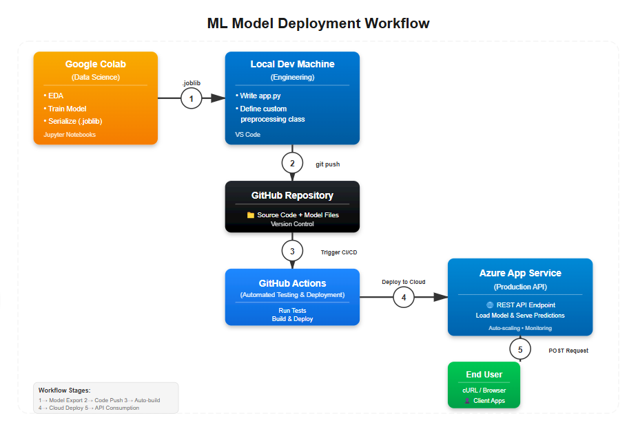
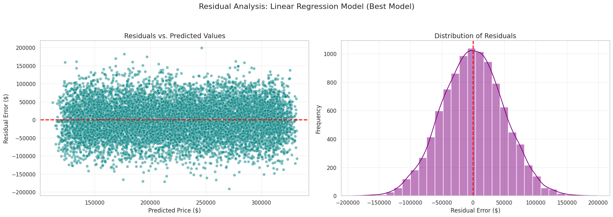

# End-to-End Housing Price Predictor (Research to Production)


[](https://github.com/oluwadunni1/flask-ml-azure-serverless/actions/workflows/master_flask-ml-dunni-2026.yml)

A production-grade Machine Learning system that predicts housing prices. This project demonstrates the full lifecycle of an ML product: from **proving the hypothesis** (in Notebooks) to **deploying the solution** (via CI/CD on Azure).

---

## System Architecture
The pipeline automates the transition from experimental code to a production API.

**Data Science** $\rightarrow$ **Engineering** $\rightarrow$ **Production**



1. **Training:** Custom pipeline (Imputation $\rightarrow$ Scaling $\rightarrow$ Linear Regression) trained in Colab.
2. **Serialization:** Model & Preprocessing logic bundled into a single `.joblib` artifact to prevent training-serving skew.
3. **App:** Flask application serves the model as a REST API.
4. **CI/CD:** GitHub Actions automatically tests and deploys code to Azure App Service on every push.

---

## Part 1: The Research (Data Science)
*Objective: Rigorously test whether model complexity translates to better performance.*

Before building the app, I benchmarked **Linear Regression** against **XGBoost** and **KNN**. The analysis proved that a simple, interpretable linear model outperformed "black box" alternatives for this dataset.

### Model Evaluation
| Model               | Test R² | RMSE  |
|---------------------|---------|-------|
| **Linear Regression** | **0.5768** | **49,577** |
| XGBoost             | 0.5615  | 50,468 |
| KNN (k = 34)        | 0.5606  | 50,517 |

### Key Findings
1. **Simplicity Wins:** The performance gap suggests **no hidden non-linear patterns** exist. Complex algorithms merely overfitted the noise.
2. **Ablation Study:** A single feature (`SquareFeet`) explained ~99% of the variance. Adding features like `Bedrooms` provided negligible lift ($\Delta R^2 \approx 0.007$).
3. **Statistical Validation:** Residual diagnostics (below) confirmed homoscedasticity and normality, proving the linear model captured 100% of the available signal.



---

## Part 2: The Engineering (MLOps)
*Objective: Deploy the chosen model as a scalable, automated API.*

To operationalize the Linear Regression model, I solved several engineering challenges:
* **Pipeline Encapsulation:** I built a custom `HousingFeatureEngineer` class to handle preprocessing. This ensures raw JSON input from the API is treated exactly like the training data.
* **Dependency Management:** Pinned `scikit-learn` versions to solve namespace mismatches between the Colab training environment and the Azure Linux server.
* **Parity Testing:** Validated that `Colab Prediction` == `Local Prediction` == `Cloud Prediction` to ensure reproducibility.

---

## Live Demo & API Usage

### 1. Verification (Live Cloud Prediction)
Below is a verification of the API running live on Azure, correctly processing a JSON payload and returning a prediction.


### 2. Test It Yourself
The API is public. You can send a POST request to get a prediction:

```bash
curl -X POST [https://flask-ml-dunni-2026.azurewebsites.net/predict](https://flask-ml-dunni-2026.azurewebsites.net/predict) \
     -H "Content-Type: application/json" \
     -d '{
           "SquareFeet": [2500],
           "Bedrooms": [3],
           "Bathrooms": [2],
           "YearBuilt": [2015],
           "Neighborhood": ["Rural"]
         }'
```

## Project Structure 

```text
├── .github/workflows        # CI/CD: GitHub Actions configuration
├── figures/                 # Documentation: Architecture diagrams, plots & screenshots
├── notebooks/               # Research: EDA, Model Comparison (Linear vs XGBoost)
├── app.py                   # Application: Flask API entry point
├── Dockerfile               # Deployment: Container configuration for reproducibility
├── Makefile                 # Automation: Shortcuts for installation (make install) & linting
├── housing_full_pipeline.joblib  # Artifact: Serialized model & pipeline object
├── make_predict_azure_app.sh # Testing: Script to send cURL requests to the live Azure app
├── make_predict.sh          # Testing: Script to test the Flask app locally
├── preprocessing.py         # Engineering: Custom feature transformation classes
├── requirements.txt         # Dependencies: Python package list (pinned versions)
└── README.md                # Documentation: Project overview & setup guide
